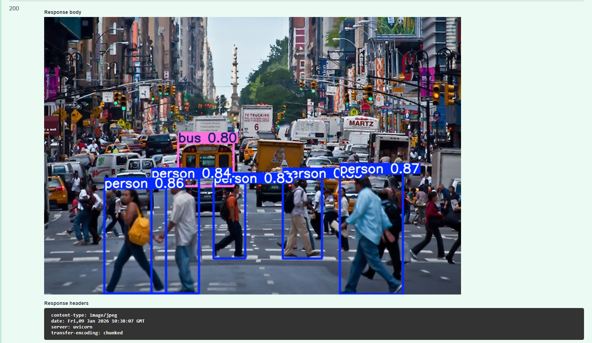
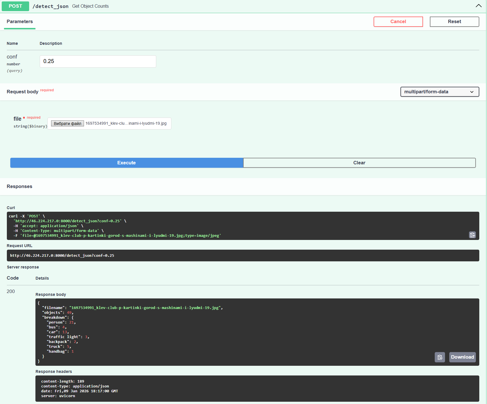

# 👁️ YOLOv8 Real-time MLOps Service

   

A production-ready Computer Vision service designed for real-time object detection. It features a scalable FastAPI backend, Dockerized deployment, CPU optimization algorithms, and a full observability stack (Prometheus & SQLite logs).


> _Note: This dashboard demonstrates real-time inference capabilities with minimal latency._


## 🚀 Key Features

- **⚡ Real-time Inference:** Streams processed video via MJPEG with YOLOv8 bounding boxes.
- **🛠️ MLOps Architecture:**
  - Fully **Dockerized** for easy deployment.
  - **Configuration Management** via `.env` files (12-factor app).
  - **CI/CD Ready** structure.
- **📉 CPU Optimization:** Implemented "Smart Throttling" algorithm to maintain stable 30 FPS and prevent CPU overheating on standard hardware.
- **📊 Observability:**
  - **Prometheus Metrics** (`/metrics`) for monitoring request latency and throughput.
  - **SQLite Logging** for tracking detection history on uploaded images.
- **🛡️ Security:** Stream endpoints hidden from Swagger documentation to prevent service overload.
- **🎨 Interactive Dashboard:** Custom Dark Mode UI for monitoring system status and video feed.

## 🛠️ Tech Stack

| Component | Technology | Description |
|---|---|---|
| **Framework** | **FastAPI** | High-performance async web framework. |
| **Model** | **YOLOv8 (Ultralytics)** | State-of-the-art object detection model (`yolov8n.pt`). |
| **Vision** | **OpenCV** | Image processing and video stream handling. |
| **Database** | **SQLite** | Lightweight storage for detection logs. |
| **Container** | **Docker** | Multi-stage build based on `python:3.12-slim`. |
| **Metrics** | **Prometheus** | Instrumentator for exposing app metrics. |

## 🏗️ Project Structure

```
.
├── data/                  # Persisted data (SQLite DB)
├── main.py                # Application entry point & logic
├── Dockerfile             # Docker image configuration
├── requirements.txt       # Python dependencies
├── .env.example           # Template for environment variables
└── README.md              # Project documentation
```

## ⚡ Quick Start

### Prerequisites
- Docker & Docker Compose installed.
- Git.

### 1. Clone the Repository
```bash
git clone https://github.com/Western-1/YOUR_REPO_NAME.git
cd YOUR_REPO_NAME
```

### 2. Configure Environment
```bash
cp .env.example .env
# You can modify VIDEO_SOURCE in .env to use a YouTube URL, RTSP stream, or local file.
```

### 3. Build & Run with Docker
```bash
# Build the image
docker build -t yolo-service .

# Run the container (Map port 8000 and mount data volume)
docker run -d -p 8000:8000 -v $(pwd)/data:/app/data --env-file .env --name yolo-app yolo-service
```

### 4. Access the Service
- **Dashboard:** http://localhost:8000
- **API Documentation:** http://localhost:8000/docs
- **Metrics:** http://localhost:8000/metrics

## 📡 API Endpoints

| Method | Endpoint | Description |
|---|---:|---|
| `GET` | `/` | Main Dashboard (HTML). |
| `POST` | `/detect_image` | Upload an image, get it back with bounding boxes + Log to DB. |
| `POST` | `/detect_json` | Upload an image, get JSON stats (e.g., `{"person": 3, "car": 1}`). |
| `GET` | `/history` | View recent detection logs from the database. |
| `GET` | `/metrics` | Prometheus scraping endpoint. |
| `GET` | `/video_feed` | **(Internal)** MJPEG video stream. |

## ⚙️ Configuration (.env)

| Variable | Default | Description |
|---|---|---|
| `APP_NAME` | `YOLOv8 MLOps Service` | Name displayed on Dashboard. |
| `MODEL_PATH` | `yolov8n.pt` | Path to the YOLO weight file. |
| `VIDEO_SOURCE` | *(Intel Sample Video)* | URL to video file, YouTube link, or RTSP stream. |
| `MAX_LOG_ENTRIES` | `1000` | Database rotation limit. |





---

### 👨‍💻 Author

Developed by **Andriy Vlonha** ([@Western-1](https://github.com/Western-1)).

## 📝 License

MIT License - see [LICENSE](LICENSE) file for details.

Copyright (c) 2026 Andriy Vlonha

---

## 📞 Contact

**Andriy Vlonha**
📧 Email: [andriy.vlonha.dev@gmail.com](mailto:andriy.vlonha.dev@gmail.com)
💼 LinkedIn: [Andriy Vlonha](https://www.linkedin.com/in/андрій-влонга-9562b537b)
🐙 GitHub: [@Western-1](https://github.com/Western-1)
📱 Telegram: [@Westerny](https://t.me/Westerny)

---
